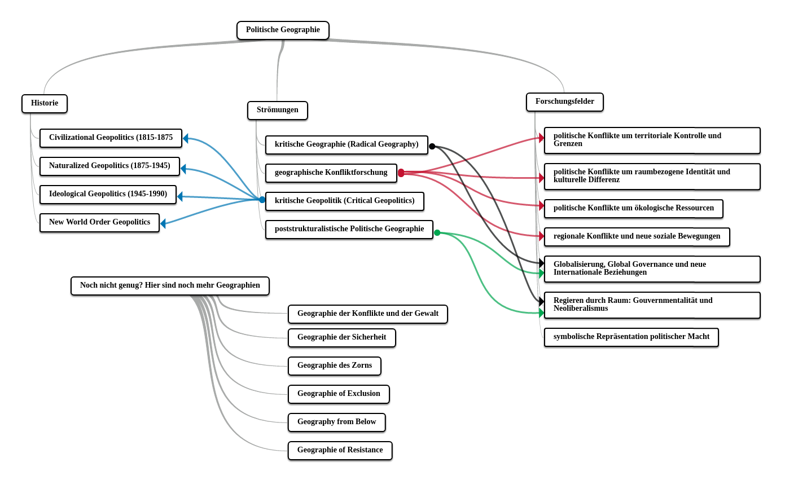
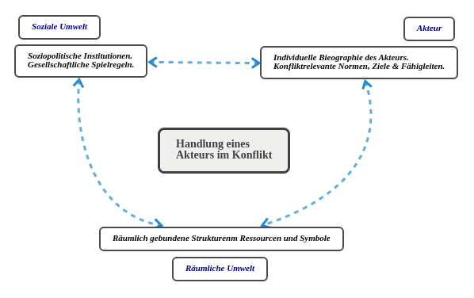

# Konzepte der Politischen Geographie

## Übersicht

## Historie - geopolitisches Denken 
>nach Agnew/Corbridge 1995

1. **Civilizational Geopolitics** (1815-1875)
  - Balance of Power (1815) durch den Wiener Kongress zur Friedenssicherung in Europa
  - neue Welle von Kolonialisierung (vor allem durch Großbritannien)
  - Rechtfertigung
    - Erhaltung der Zivilisation
    - Missionierung

2. **Naturalized Geopolitics** (1875-1945)
  - Raum ist begrenzt 
  - enge Verbindung von Volk und Teritorium
  - der Staat definiert sich über den Lebensraum welcher sich ständig verändert. (Expansion und Schrumpfung von Landesgrenzen)
    - Staat als Organismus
    - "survival of the fittest" (Darwinismus)
    - findet Anklang in faschistischen und nationalistischen Staaten (NS-zeit) 

3. **Ideological Geopolitics** (1945- 1990)
  - Verengung der geographischen Weltwahrnehmung
  - geopolitical monochrome of good versus evil
    - West vs. Ost
    - Kapitalismus vs. Kommunismus
    - Kalter Krieg und Stellvertreter Kriege

4. **New World Order Geopolitics**
  - nach dem "Sieg" des Kapitalismus entstehende (dissolution of the geopolitical monochrome) Geopolitische Theorien
    - "Clash of Civilizations" ~ Huntington
    - Modell der globalen Fragmentierung
      - Schaltstellen des wettbewerbsgesteuerten Weltgeschehens sind globale Orte, in denen die Kommandozentralen der als global player agierenden Unternehmen bzw. Weltorganisationen stehen. (Kaldor 2000)
      - new periphery (am Rande liegend, Gegensatz eines Zentrums)
      - gated communities
  - keine Staatenkriege (siehe auch [alte Kriege](http://kollektive-geographie-heidelberg.de/politische-geographie/05-geographie-konflikte-gewalt.html)) mehr

## Aktuelle Forschungsansätze
>nach Reuber 2012

### Strömungen der Politischen Geographie

1. **Kritische Geographie (Radical Geography)**
  - politökonomische Theorieansätze
    - soziale Ungleichheit
    - negative Folgen kapitalistischer Systeme

2. **Geographische Konfliktforschung**
  - handlungs- und konflikttheoretische Ansätze
  - raumbezogene Konflikte und Flächennutzungskonflikte

3. **Kritische Geopolitik (Critical Geopolitics)**
  - Handlungstheorie und konstruktivistischen Raumtheorie
  - Dekonstruktion geopolitischer Diskurse und Leitbilder insbesondere in ihrer sprachlichen und kartographischen Diminsionen

4. **poststrukturalistische Politische Geographie**
  - Diskurstheorie / Gouvernmentalitätsansätze
    - der Einfluss supranationaler Institutionen und Akteuren auf nationalstaatliche Regierungen
      - formelle Institutionen: EU, UNO, ...
      - informelle Institutionen und andere Akteure: NGO´s, Multinationale Unternehmen, ...

siehe auch: [Ein kleiner Überblick](politische-geographie/01-geographie-kompakt.md)

**Konstruktivimus**
- Erkenntnistheorie ([Spektrum](http://www.spektrum.de/lexikon/psychologie/konstruktivismus/8103))
- Ist unsere Wahrnehmung (Weltbild) die Abbildung der Realität oder ist sie "konstruiert"?
- Wie wurden und werden Wahrheiten konstruiert?

**Akteursbezogene & Handlungsorientierte Ansätze**
- Wer? -> Welche Akteure sind an politische Konflikten beteiligt?
- Was? -> Welche Interessen und Ziele haben diese Akteure?
- Wie? -> Welche Strategien setzten sie zur Erreichung ihrer Ziele ein?

### Forschungsfelder der Politischen Geographie

- **politische Konflikte um territoriale Kontrolle und Grenzen**
  - gescheiterte und wiedervereinigte Staaten

- **politische Konflikte um raumbezogene Identität und kulturelle Differenz**
  - Konstruktion territorialer Identitäten (z. B. durch Grenzziehungen)
- **politische Konflikte um ökologische Ressourcen**
  - Umweltkonflikte und Konflikte um natürliche Ressourcen

- **regionale Konflikte und neue soziale Bewegungen**
  - handlungsorientierte Konfliktforschung
  - Konflikte um Infrastrukturen und die Gestaltung von Lebensraum
  - Geography of Resistance
  - Geography from Below

- **Globalisierung, Global Governance und neue Internationale Beziehungen**
  - Einfluss von supranationalen Akteuren
    - formelle Institutionen: UNO, EU, ASEAN
    - informelle Institutionen und andere Akteure: Multinationale Unternehmen, NGO´s
  - 

- **Regieren durch Raum: Gouvernementalität und Neoliberalismus**
  - Gouvernementalität
    - Komplexe Form des Ausüben von Macht ("regieren")
  - Neoliberalismus
    - Denkrichtung des Liberalismus. Sieht das Eingreifen des Staates in die freie Marktwirtschaft als nötig um diese zu bewahren.

- **symbolische Repräsentation politischer Macht**
  - Konstruktion und Instrumentalisierung klassischer Formen von geopolitisch relevanten Identitäten
    - "Flaggenkult"
    - [Humbold Forum](https://de.wikipedia.org/wiki/Humboldtforum)
      - Wiederaufbau des Preußischen Stadtschlosses in Berlin
    - Schloss Versailles
    - Erdoğans Präsidentenpalast

 

------

Lade dieses Kapitel als [PDF](http://kollektive-geographie-heidelberg.de/politische-geographie/04-konzepte-politische-geographie.pdf) herunter

Lade die ganze Rubrik *politische-geographie* als [PDF](http://kollektive-geographie-heidelberg.de/politische-geographie/politische-geographie.pdf) herunter

------
